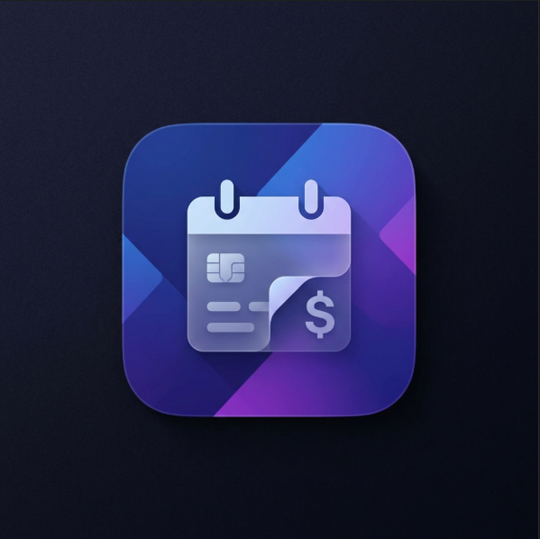

# 📅 Abonelik Takvimi (Subscription Calendar)

Modern, performant ve kullanıcı dostu bir masaüstü abonelik takip uygulaması. Yaklaşan ödemelerinizi takip edin, harcamalarınızı analiz edin ve bildirimlerle gününde haberdar olun.



## 🚀 Özellikler

- **Abonelik Yönetimi**: Netflix, Spotify, AWS gibi aboneliklerinizi ekleyin, düzenleyin ve kategorize edin.
- **Akıllı Takvim Görünümü**: Aylık ödemelerinizi takvim üzerinde görselleştirin.
- **Masaüstü Bildirimleri**: Ödeme günü yaklaşan abonelikler için Windows masaüstü bildirimi alın.
- **Karanlık & Aydınlık Mod**: Sistem temanıza uyumlu veya manuel olarak değiştirilebilir modern arayüz.
- **Detaylı Analiz**: Aylık toplam harcamanızı ve yaklaşan ödemelerinizi anlık görün.
- **Güvenli & Yerel**: Tüm verileriniz yerel cihazınızda (SQLite) şifreli olarak saklanır. Buluta veri göndermez.
- **Yedekleme**: Verilerinizi JSON formatında dışa aktarın ve geri yükleyin.

## 🛠️ Teknolojiler

Bu proje, modern web teknolojilerini native performans ile birleştirir:

- **Core**: [Tauri v2](https://tauri.app) (Rust + Webview)
- **Frontend**: [React](https://react.dev), [TypeScript](https://www.typescriptlang.org)
- **UI Framework**: [TailwindCSS](https://tailwindcss.com), [Shadcn/UI](https://ui.shadcn.com)
- **State Management**: [Zustand](https://github.com/pmndrs/zustand)
- **Database**: SQLite (via `tauri-plugin-sql`)
- **Build Tool**: [Vite](https://vitejs.dev), [pnpm](https://pnpm.io)

## 📦 Kurulum (Release)

En güncel sürümü **Releases** sayfasından indirebilirsiniz.

- **Windows**: `.msi` veya `.exe` dosyasını indirip kurun.

## 💻 Geliştirme (Development)

Projeyi yerel ortamınızda çalıştırmak için:

1. **Gereksinimler**:
   - Node.js (v20+)
   - Rust (latest stable)
   - pnpm

2. **Bağımlılıkları Yükle**:

   ```bash
   pnpm install
   ```

3. **Geliştirme Sunucusu**:

   ```bash
   pnpm tauri dev
   ```

4. **Build (Production)**:
   ```bash
   pnpm tauri build
   ```

## 🤝 Katkıda Bulunma (Contributing)

Pull request'ler memnuniyetle karşılanır. Büyük değişiklikler için önce bir issue açarak tartışmanızı öneririz.

## 📄 Lisans

MIT License ile lisanslanmıştır.

## Görseller


